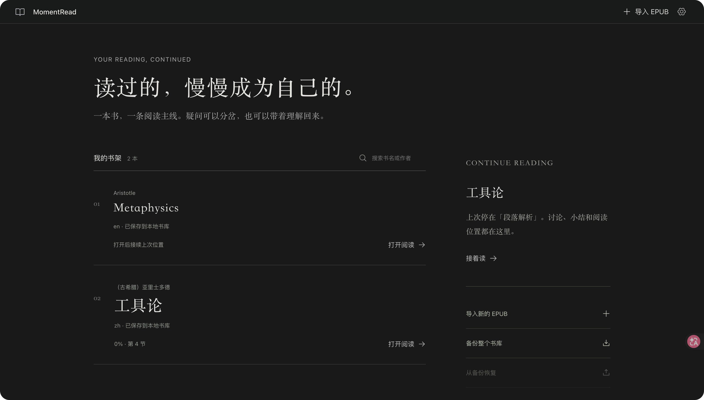
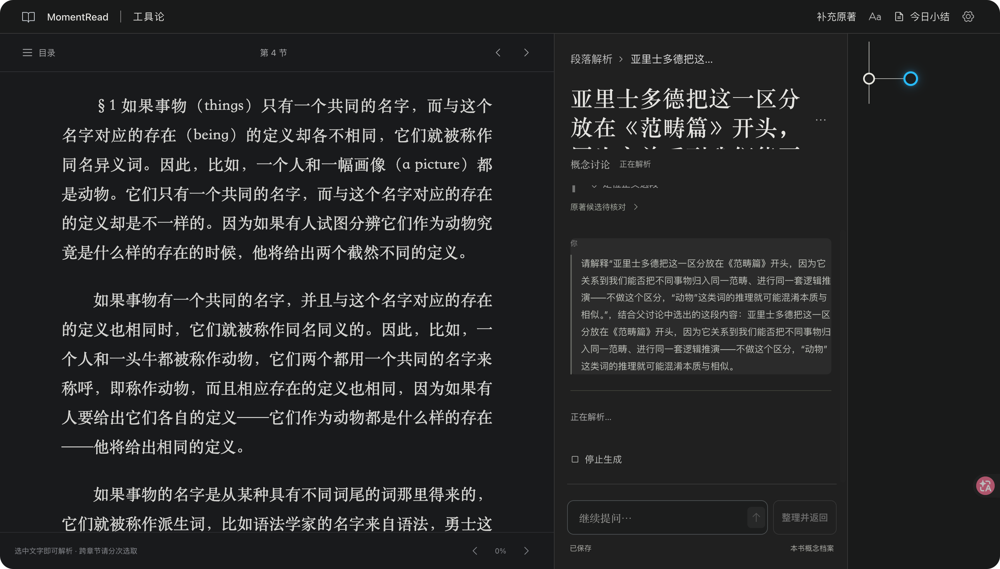

# MomentRead

[](https://github.com/CamellionKid/momentread/actions/workflows/ci.yml)

在浏览器里阅读 EPUB，遇到不懂的段落时请求 AI 解析；把概念展开成独立分支，再整理并返回原来的阅读思路。

各版本更新内容见 [CHANGELOG.md](CHANGELOG.md)。





**当前状态：阅读与学习主链已完成实际验收；自动原著发现和最终提交盲测尚未放行。** 生产入口位于仓库根目录。额度恢复后真实首次调用、明确接续、小结和今日总结均通过。原著自动检索仍有明确阻塞：本机 Claude provider 的 WebSearch 返回零条结果，不能宣称自动匹配已可用。候选独立取回与文字核对已有另外的实测，二者不能混为一谈。当前验证状态见 [开发清单](docs/development/STATUS.md)、[首版验收](docs/development/ACCEPTANCE.md)、[独立系统测试](docs/development/SYSTEM-TESTS.md) 和 [Claude 实测](docs/development/CLAUDE.md)。

## 快速开始

1. **装 Claude Code**（MomentRead 通过它调用 AI）：`curl -fsSL https://claude.ai/install.sh | bash`，然后 `claude auth login` 登录一次。已有配置不用重复登录。
2. **跑起来**（需 Node 22.23，见 [.nvmrc](.nvmrc)）：

   ```sh
   git clone https://github.com/CamellionKid/momentread.git
   cd momentread
   npm ci
   npm run build
   npm start
   ```

   打开 <http://127.0.0.1:4317>。
3. **上传 EPUB**：在空书架页面点导入，选择一个未加密、可选文字的 EPUB 文件。应用会保存原文件副本与指纹，之后移动或删除原文件不影响书库。
4. **开始学习**：在正文选中一段不懂的文字 → 点击「解析一下」→ 在 AI 回答里选中想深入的概念 → 「展开选中的概念」逐层追问 → 「整理并返回」回到阅读主线。
5. **确认 AI 正常**：首次使用建议先跑 `npm run test:live -- first` 做真实调用自检（会消耗少量额度）。

更详细的每一步说明在下方「[准备环境](#准备环境)」「[安装与启动](#安装与启动)」「[使用流程](#使用流程)」。

## 准备环境

- 首版目标：macOS + Chrome 桌面浏览器。Safari、Codex 内嵌浏览器及其他平台不在当前已承诺的支持范围。
- Node.js：使用 [.nvmrc](.nvmrc) 的 **22.23.0**；当前 package engines 为 `>=22.23.0 <23`。npm 随 Node 安装。
- Claude Code CLI：当前实际验证版本为 **2.1.261**，须能在启动 MomentRead 的环境中找到 `claude`，并具有可用的登录或 provider 配置。
- 书籍：可重排、可选文字、未加密的 EPUB。原著补充支持 EPUB 或 UTF-8 TXT。固定版式、扫描件 OCR 和 DRM 不属于首版支持范围。

Claude Code 尚未安装时，按[官方安装说明](https://code.claude.com/docs/en/setup)安装。macOS 官方原生安装入口为：

```sh
curl -fsSL https://claude.ai/install.sh | bash
```

已有可用配置不需要重新登录。先检查版本及认证；未登录时再执行登录命令，按浏览器提示完成。认证方式另见[官方认证说明](https://code.claude.com/docs/en/authentication)。

```sh
claude --version
claude auth status
# 仅在需要登录时执行：
claude auth login
```

MomentRead 不需要额外启动一个 Claude 聊天窗口或 Claude HTTP 服务。产品服务会按运行任务调用 CLI 子进程。

### 可选：使用 opencode 作为 AI 运行时

除 Claude Code 外，MomentRead 也支持用 [opencode](https://opencode.ai) 驱动讨论与小结（原著检索暂不支持，opencode 模式下该功能会明确提示不可用）。安装并登录 opencode 后，在「AI 连接与本地数据」对话框中即可直接切换运行时（Claude Code / opencode），切换立即生效并持久保存，无需重启；有正在进行的生成时需等其结束后才能切换。

模型可在同一对话框中下拉选择（列出当前运行时的可用模型，两个运行时的模型选择各自独立保存）；也可用 `MOMENTREAD_AI_MODEL=provider/model` 指定默认模型。`MOMENTREAD_AI=opencode` 环境变量仍可用于指定**首次启动**的默认运行时；一旦在界面中切换过，以界面选择为准。

## 安装与启动

在 **MomentRead 仓库根目录**执行。获取源码：

```sh
git clone https://github.com/CamellionKid/momentread.git
cd momentread
```

若使用 nvm，先让当前终端采用项目版本；已经使用正确 Node 版本时可跳过这两条：

```sh
nvm install
nvm use
```

安装、构建并启动：

```sh
npm ci
npm run build
npm start
```

打开 [http://127.0.0.1:4317](http://127.0.0.1:4317)。服务终端会打印实际地址与数据目录。`npm start` 使用构建结果，修改代码后须重新构建；停止服务用终端 `Ctrl+C`。

### 让 Agent 帮你装好

把本仓库链接发给你的编码 Agent（Claude Code、Codex 等），它可以直接按本说明完成安装与启动。对 Agent 说类似：

> 克隆 https://github.com/CamellionKid/momentread 并构建启动。若 `claude` CLI 未安装先安装并提示我完成登录；构建完成后以后台方式启动服务，等我确认浏览器页面正常后，再为本机设置一个终端快速启动命令（例如 shell 函数 `momentread`：已在运行就直接打开浏览器，否则后台启动服务并自动打开 http://127.0.0.1:4317）。

Agent 执行时的要点（也是验收标准）：

1. 检查 Node 22.23 与 [.nvmrc](.nvmrc) 一致；检查 `claude --version` 与认证状态，需要登录时**暂停并提示用户本人完成浏览器登录**，不代替用户认证。
2. `npm ci` → `npm run build` → 后台启动 `npm start`，用 HTTP 请求探测 `http://127.0.0.1:4317` 就绪后再交给用户。
3. 设置快速启动时：检测端口避免重复起服务；服务放后台运行并在用户 Shell 配置中只写一个函数或别名的最小实现；完成后**读回验证**函数存在且页面可访问。
4. 首次验证 AI 可用可运行 `npm run test:live -- first`（真实调用，消耗少量额度，先征求用户同意）。

安装中的常见问题见下方「排查入口」表。

默认数据目录为：

```text
~/Library/Application Support/MomentRead
```

试用或测试时可以使用独立目录，不影响已有书库：

```sh
MOMENTREAD_DATA_DIR="$HOME/Library/Application Support/MomentRead-test" npm start
```

重启接续必须使用相同数据目录。应用当前不会自动加载 `.env`；配置应由启动终端的环境变量提供。构建模式可通过 `MOMENTREAD_PORT` 改端口，例如：

```sh
MOMENTREAD_PORT=4318 npm start
```

只使用本机地址。首版没有公网部署、用户账户或多租户认证流程。

## 确认 AI 可用

界面右上角「AI 连接与数据」分别显示 CLI 安装、认证报告和实际调用状态。安装成功或认证报告为真，都不能代替一次实际返回。

首次连接检查可用合成短文本，不读取书籍：

```sh
npm run test:live -- first
```

该命令会真实调用已配置模型并消耗其额度；返回完整中文结果且命令成功退出才算此项通过。搜索能力须单独验证，普通回复成功不代表 WebSearch 可用：

```sh
npm run test:live -- language
```

`language` 使用三份不含私人书籍内容的合成阅读问题，实际检查自然简体中文以及标题、列表和加粗输出；任一回答混入拉丁字母即失败。它用于检查当前 provider 的输出质量，不能替代真实书籍界面盲测。

```sh
npm run test:live -- search
```

`search` 探针只执行公开测试查询，并自动允许该用例的网络权限。产品界面在每次原著匹配运行开始时询问一次「允许本次检索／拒绝本次检索」；允许范围只覆盖该运行的 WebSearch／WebFetch，最多 3 次搜索和 5 次正文取回，不写入永久权限。当前环境的公开网络工具结果见 [Claude 实测](docs/development/CLAUDE.md)。

### 已有 provider 配置如何进入 CLI

MomentRead 从进程环境及 Claude 既有配置取得连接信息。读取的文件是 `$CLAUDE_CONFIG_DIR/settings.json`；未设置该目录时为 `~/.claude/settings.json`。**只提取其中 `env` 的以下字符串键，进程环境同名值优先**：

- `ANTHROPIC_API_KEY`、`ANTHROPIC_AUTH_TOKEN`、`ANTHROPIC_BASE_URL`、`ANTHROPIC_MODEL`。
- `ANTHROPIC_DEFAULT_FABLE_MODEL`、`ANTHROPIC_DEFAULT_HAIKU_MODEL`、`ANTHROPIC_DEFAULT_OPUS_MODEL`、`ANTHROPIC_DEFAULT_SONNET_MODEL`，及对应追加 `_NAME` 的键。
- `CLAUDE_CODE_OAUTH_TOKEN`。

这不是加载整个 settings 文件。产品使用隔离的运行目录和工具白名单，不继承该文件的 hooks、plugins、skills、MCP 或永久权限规则；不会修改原有配置。认证值不进入前端、仓库或产品备份。完整行为与诊断边界见 [Claude 模块说明](docs/development/CLAUDE.md)。

## 使用流程

1. 从空书架导入 EPUB。应用保存原件副本与文件指纹；之后移动原文件不影响书库副本。
2. 在正文中正常阅读；使用目录、章节导航和字号控件调整阅读。每次拖选在一个章节内完成，跨章节请分次选择。
3. 选中文字后点击「解析一下」。界面建立对应讨论，先尝试寻找原著依据，再解析；找不到原著时明确保留未核对状态，仍可进行中文解析。
4. 在 **已完成的 AI 回答中选中概念文字**，点击「展开选中的概念」。可编辑名称；同一回答支持多个兄弟分支，每个分支可继续展开下一层。
5. 普通问题直接在当前讨论输入。点击线路节点只切换讨论，不会自动完成它；线路默认不显示文字，悬停或聚焦可看名称，蓝圈只表示当前位置。
6. 点击「整理并返回」，编辑小结后确认保存。成功才回到直接父讨论；根段落的入口是「整理这段」。小结历史、书内义项及待合并更新均保留。
7. 在原著面板查看候选、版本和实际取回的文字。选中仍表示待核对；自行对照后再确认。可用「补充原著」导入本书外文文件，随后重新匹配。
8. 「今日小结」按日期和时区展示保存记录；可生成 AI 总结与建议、导出离线 HTML。
9. 等输入区显示「已保存」后关闭窗口或停止服务。重新启动、打开同一书库即可接续；中断的生成不会自动重发。

用户补充的整本原著也不保证任意段落都能自动对应。当前定位先选择有限文本窗口，中外文词汇不重合时可能找不到相关窗口；公开检索失败不会被替换成未验证的搜索服务。详见 [原著匹配边界](docs/development/MATCHING.md)。

## 数据、备份与恢复

| 数据                                                       | 保存位置／范围                                                   |
| ---------------------------------------------------------- | ---------------------------------------------------------------- |
| 书籍、讨论、阅读位置、草稿、小结、概念、来源与产品运行事件 | 数据目录内 `momentread.sqlite`；运行时伴随 SQLite WAL 文件       |
| 导入 EPUB／原著副本                                        | 数据目录内 `files/`，按不可变文件版本保存                        |
| 产品生成的备份                                             | 数据目录内 `backups/`，并可从浏览器下载 ZIP                      |
| CLI 指定工作目录                                           | 数据目录内 `runtime/claude`；CLI 自身认证及会话文件仍由 CLI 管理 |

书架或「AI 连接与数据」中的「备份书库」会生成一致的数据库快照，附带书籍／原著文件、文件指纹与清单。ZIP 包含产品保存的消息、背景和运行事件，**不复制 CLI 凭据、原始会话日志、用户 Claude 配置或整个 CLI 历史目录**。下载链接只在当前产品服务进程内有效；重启后需要重新创建下载链接，已下载的 ZIP 不受影响。HTML 小结用于回看，不能替代 ZIP 备份。

恢复仅允许空书库。保留原数据目录，停止服务后以新的目录启动，例如：

```sh
MOMENTREAD_DATA_DIR="$HOME/Library/Application Support/MomentRead-restored" npm start
```

打开书架，选择「从备份恢复」并上传 ZIP。服务校验清单、数据库及文件指纹；不会覆盖已有书库。恢复后的讨论、小结和阅读位置来自产品记录；CLI 会话关联保留为历史，但标为不可接续。下一次提问会新建 CLI 会话，并传入保存的产品背景，不依赖另一台机器的原始 CLI 会话文件。

更新应用前先导出备份，再停止服务、安装新依赖并重新构建。数据目录独立于代码目录；目前数据库版本为 1，较新的数据库版本会被旧程序明确拒绝，未提供任意版本降级迁移。需要回退时，使用与备份兼容的程序和新的空数据目录恢复。

### 哪些内容会发出本机

打开、导入和翻阅 EPUB 不会自动上传整本书。主动发起 AI 任务时，会发送选段、必要邻近文字、书籍信息、当前讨论及相关已确认背景。分支只继承截至所选父消息的背景；不会自动把兄弟未确认全文一起发送。

原著匹配会发出公开查询与有限选段；补充原著时最多选择 5 个、每个 2,200 字符的原著窗口提供给模型。页面候选由本地服务独立取回，不带浏览器 Cookie 或登录态。模型和查询由现有 CLI provider 处理；“本地网页”不表示 AI 推理离线。具体上限与记录方式见 [学习服务](docs/development/LEARNING.md) 和 [匹配服务](docs/development/MATCHING.md)。

## 开发与测试

开发模式使用两个终端，均位于仓库根目录。第一个运行本地服务，第二个运行 Vite：

```sh
# 终端一
MOMENTREAD_DATA_DIR="$HOME/Library/Application Support/MomentRead-dev" npm run dev
```

```sh
# 终端二
npm run dev:ui
```

打开 [http://127.0.0.1:5173](http://127.0.0.1:5173)。开发代理固定指向 `127.0.0.1:4317`，因此开发时保持服务默认端口；不要把构建模式的端口更改直接用于此代理。

```sh
npm run typecheck
npm test
npm run test:unit
npm run test:integration
npm run test:contract
npm run contracts
npx tsx tests/browser/run-scale.ts --port 4325
```

`contracts` 从共享 schema 生成 OpenAPI 文档。普通测试使用合成或公开测试材料，不自动调用真实模型。真实调用另行选择场景：

```sh
npm run test:live -- resume
npm run test:live -- isolation
npm run test:live -- cancel
npm run test:live -- summary
npm run test:live -- fetch
npm run test:live -- deny
```

真实 EPUB 测试只在显式指定已获授权的文件时读取该文件：

```sh
MOMENTREAD_TEST_EPUB='/absolute/path/to/authorized-book.epub' npm test -- tests/unit/reader.test.ts tests/unit/reader-epub.test.ts
```

示例路径需要替换为自己的文件。以上自动化不能代替真实浏览器、进程重启、离线导出和新用户盲测；当前完成情况以各项验收记录为准，不能仅凭 `npm test` 全绿宣称整版可用。

## 排查入口

| 现象                        | 操作                                                                                                      |
| --------------------------- | --------------------------------------------------------------------------------------------------------- |
| 网页打不开                  | 确认服务仍在运行，并使用终端打印的地址；首次 `npm start` 前执行 `npm run build`                           |
| `npm ci` 的原生模块安装失败 | 确认 Node 与 `.nvmrc` 一致；按照安装日志补齐本机编译依赖后重试，不删除书库                                |
| 有认证报告但 AI 不回复      | 用 `npm run test:live -- first` 检查实际调用；查看界面的运行错误与 [CLI 记录](docs/development/CLAUDE.md) |
| 原著搜索 403 或无结果       | 保留“尚未核对”的中文解析；可补充原著或修复 provider 网络工具后重新检索，不能据此确认原文                  |
| 看不到上次书籍              | 核对启动终端打印的数据目录；测试、恢复与默认书库是不同目录                                                |
| 讨论显示保存失败            | 保留窗口与编辑内容，点击重试；等到「已保存」后切换或关闭                                                  |
| 恢复提示书库非空            | 保留现有书库，改用新的 `MOMENTREAD_DATA_DIR`；不通过删除记录绕过检查                                      |
| 备份链接失效                | 在当前服务中重新生成备份；已经下载的 ZIP 可继续保留                                                       |

## 设计原型与项目资料

`prototype/` 是独立的演示原型，继续作为视觉参考；它的 AI、EPUB 与来源数据是演示内容，不能代替根目录生产工程。启动方法见 [原型 README](prototype/README.md)。

- [需求与 A01–A21 验收条件](docs/PRD.md)
- [技术架构与已实现的选择](docs/ARCHITECTURE.md)
- [UI／UX 设计](docs/design/UI-UX.md)、[生产界面接入](docs/development/PRODUCT-UI.md)
- [公共契约](docs/development/CONTRACTS.md)、[HTTP 接口](docs/development/HTTP.md)、[OpenAPI](docs/development/openapi.json)
- [开发状态](docs/development/STATUS.md)、[最终验收](docs/development/ACCEPTANCE.md)、[盲测记录](docs/development/BLIND-TEST.md)、[浏览器规模验收](docs/development/BROWSER-SCALE.md)
- [ThoughtDAG 复用研究](docs/research/thoughtdag-reuse.md)、[foliate-js 来源与本地适配](vendor/foliate-js/README.momentread.md)

本仓库使用 `main`；提交格式为 `[scope] short imperative description`。只暂存本次相关文件，凭据、书籍、学习数据、依赖和构建产物不进入 Git。

## 许可

本项目以 [MIT](LICENSE) 发布；其中的 [vendor/foliate-js](vendor/foliate-js) 子集来自 foliate-js 项目，其 MIT 许可与版权归属见 [vendor/foliate-js/LICENSE](vendor/foliate-js/LICENSE)。参与方式见 [CONTRIBUTING](CONTRIBUTING.md)。

**诚实披露**：自动原著发现（候选检索）当前未放行——本机 Claude provider 的 WebSearch 返回零条有效来源链接，系统在该情况下诚实显示「尚未核对」，不会以未验证内容冒充原文；固定 URL 取回与用户补充原著文件可用。另外，验收期间的 CLI 实际响应模型为 `glm-5.3-flash`（provider 代理返回），与请求别名不同，细节见 [Claude 实测](docs/development/CLAUDE.md)。
