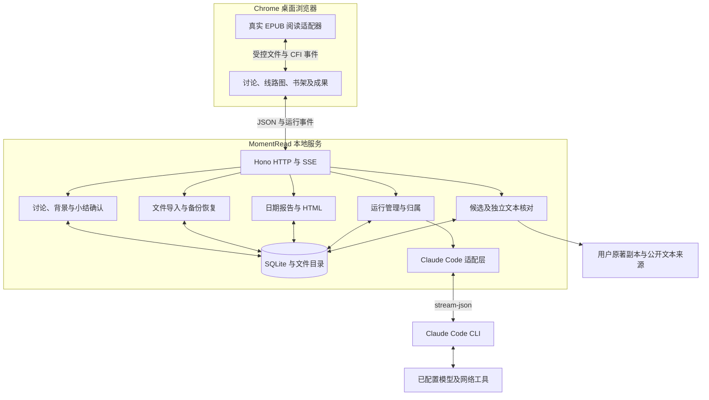

# MomentRead 技术选型与架构基线 v0.2

更新日期：2026-09-10。用户已批准真实首版开发计划，生产工程已在仓库根目录实现并进入集成验收；`prototype/` 保留为独立设计参考。

本文件区分 **已实现的工程选择** 与 **已经取得的运行证据**。代码接入、单元测试、真实 CLI、浏览器与盲测是不同验收层级。当前 Claude provider 的公开网络工具仍有阻塞，不能宣称自动原著匹配或完整首版已验收通过。

## 1. 已实现的选择

| 层级           | 当前实现                                                                          | 边界                                                                         |
| -------------- | --------------------------------------------------------------------------------- | ---------------------------------------------------------------------------- |
| 产品载体       | 独立本地网页；macOS + Chrome 桌面为首版目标                                       | 不提供桌面安装包、公网账户系统或多租户服务                                   |
| 运行时与依赖   | Node 22.23.0，npm 锁文件；`.nvmrc` 与 engines 固定                                | 安装及版本更新须保留实际构建记录                                             |
| 前端           | React 19.2、TypeScript、Vite 6.4.3                                                | `src/product` 使用真实 API；原型不参与生产数据流                             |
| 本地服务       | Node.js + Hono 4.13.7；HTTP 与 SSE                                                | 只监听 `127.0.0.1`，默认 4317；开发 Vite 5173 代理到 4317                    |
| EPUB 内核      | foliate-js 固定提交 `78914aef4466eb960965702401634c2cb348e9b1`                    | 最小代码闭包保存在 vendor，保留 MIT 许可；经独立 Reader adapter 隔离         |
| 线路图         | React + SVG 连接线与原生按钮                                                      | 黑白窄栏、唯一活动蓝圈、悬停／聚焦标签；未引入自由画布或 React Flow          |
| 产品主存储     | SQLite + better-sqlite3 13.0.3，WAL 与 FULL synchronous                           | 数据库版本 1；具名实体 JSON、运行事件和持久幂等记录，读取／写入均校验 schema |
| 文件与数据目录 | 复制导入，SHA-256 不可变文件版本；默认 `~/Library/Application Support/MomentRead` | `MOMENTREAD_DATA_DIR` 可覆盖；原文件移动不改变书库副本                       |
| AI 后端        | Claude Code CLI，当前实测 2.1.261                                                 | 唯一首版后端；复用其模型、工具循环和运行时处理，不自建通用 harness           |
| 原著匹配       | CLI 独立候选发现 + 服务端独立正文取回 + 引句核对                                  | 候选、实际取回、选中及人工确认分别记录；搜索工具失败仍是放行阻塞             |
| 书内 memory    | 独立讨论、冻结背景、确认小结与具体义项                                            | 不修改 Agent 全局记忆，同名义项不强制合并                                    |
| 成果与恢复     | 按日期／时区构建报告、AI 总结、内联样式 HTML、ZIP 备份                            | HTML 不等于备份；恢复只允许空库，CLI 凭据与原始会话日志不在备份内            |

React、Hono、数据库等精确依赖以 [package.json](../package.json) 和锁文件为准。上游阅读组件的固定提交与改动说明见 [vendor 记录](../vendor/foliate-js/README.momentread.md)，不将 foliate-js 的实验性 API 直接暴露给产品组件。

ThoughtDAG 提供了分支、背景截点及 Claude 协议参考，固定研究提交为 `3d63111dba182ece5d3c4c583ab1ac120d5276be`。产品按“一场讨论一个节点”重新实现，没有直接迁入其完整 store、任意文件访问、全局会话扫描或 bypass 权限模式。来源见[复用评估](research/thoughtdag-reuse.md)与 [Claude 模块](development/CLAUDE.md)。

DeepSeek Harness、OpenCode、直接模型 API 和外部 chatbot 多网页都没有进入当前运行路径。更换后端或搜索服务需要明确的架构变更和重新验证，不静默 fallback。

## 2. 运行结构与模块接口



生产构建生成 `dist/client` 与 `dist/server/index.js`，`npm start` 由同一个本地服务提供页面和 API。开发模式为 Node 服务与 Vite 两个终端；不需要另开 Claude 常驻 HTTP 服务。启动命令与环境说明见 [README](../README.md)。

| 所有者／模块                       | 最小接口与职责                                              | 不能越过的边界                                     |
| ---------------------------------- | ----------------------------------------------------------- | -------------------------------------------------- |
| 总负责人：公共契约、HTTP、运行管理 | 共享 schema、API client、路由、SSE、运行归属与集成          | 提供方与调用方必须同步变更，模块不私自增改公共字段 |
| A：storage／books                  | `Store`、`BookLibrary`：导入、文件身份、事务、持久化与恢复  | 不编写提示词或判断学习结论                         |
| B：reader                          | `ReaderProps`／`ReaderHandle`：打开、选区、位置、目录与字号 | 不创建讨论、不写数据库、不自动发起 AI              |
| C：ai                              | `probe/start/cancel/answerPermission`                       | 只负责 CLI 及协议，不管理正式概念记录              |
| D：learning                        | 创建根／分支、构建背景、消息、小结草稿及确认                | 通过 Store 原子保存，未确认生成结果不成为正式结论  |
| E：matching                        | 构建候选任务、独立取回、来源状态与原著修订                  | 回译、搜索摘要和模型自报不作为原文证据             |
| F：product／成果 UI                | API 接入、草稿、导航、编辑确认、来源／报告界面              | 不读取数据目录或自行调用模型接口                   |
| G／H：独立验证                     | 契约与系统测试、全新上下文只依 README 操作                  | 不由模块开发者代替盲测，不修改期望使测试通过       |

契约权威来源是 [共享 schema](../shared/contracts/index.ts) 和 [模块 ports](../shared/contracts/ports.ts)；解释见 [CONTRACTS](development/CONTRACTS.md)、[HTTP](development/HTTP.md)。`npm run contracts` 生成 [OpenAPI](development/openapi.json)。模块说明：[EPUB](development/EPUB.md)、[Claude](development/CLAUDE.md)、[Learning](development/LEARNING.md)、[Matching](development/MATCHING.md)、[Product UI](development/PRODUCT-UI.md)。

## 3. 数据关系与运行语义

| 对象                           | 实现中的身份及关系                                                                          |
| ------------------------------ | ------------------------------------------------------------------------------------------- |
| Book／FileVersion              | 书籍 UUID 与文件版本分离；副本、角色、指纹及受控路径；补充原著产生独立版本                  |
| TextReference／ReadingPosition | 绑定书籍与文件版本；spine、章节、range CFI、精确选文和前后文；位置包含 CFI 与结构进度       |
| Discussion／Message            | 一场多轮讨论一个节点；直接 parentId、rootId、消息来源选区；兄弟拥有独立消息、草稿与滚动位置 |
| ContextSnapshot                | 实际发给运行的背景、讨论 revision、消息 ID、来源与子小结依赖版本；祖先截至分支触发消息冻结  |
| Run／RunEvent／Session         | bookId、discussionId、runId 三重归属；单运行递增 seq；用途、终态、明确 CLI 会话和可接续标记 |
| SummaryVersion／Receipt        | 版本化小结与直接父级回馈；确认请求持久幂等；确认版本不能覆盖或删除                          |
| ConceptSense                   | 书内具体讨论／小结版本产生的义项，附语境与来源；同名保留各自身份                            |
| Workspace／Activity            | 活动讨论、阅读位置、字号、折叠；实际位置活动供日期报告使用，不推测时长或掌握率              |

必须保持以下语义：

1. 根解析可以有多个；每个概念只有一个直接父级，父子关系防环且不能跨书。原型主线的视觉连接不等于上下文依赖。
2. 普通追问接续明确映射的当前讨论会话；新概念建立新会话并传冻结背景。不能用“最近会话”或标题猜测归属。
3. 同一讨论只允许一个生成任务；全局运行管理限制并发。同一 SSE 连接断开后按 seq 补读已保存事件，不能因此重新调用模型。
4. 部分输出及最终消息始终写入发起运行的讨论；切换屏幕、书籍或节点不改变写入归属。启动恢复将未结束运行标为中断。
5. 草稿和位置经服务端确认后才显示已保存；UI 去抖 500 ms，切换前排空保存队列。关闭时的 keepalive 仅为尽力提交，不当作成功证据。
6. CFI 不使用屏幕页数或模糊文字搜索替代。Reader 校验实际 DOM／spine／exact 往返；学习服务负责身份和范围语法，当前未对第三方 HTTP 客户端提供完整服务器 DOM 语义验证。
7. 背景只包含用户选段、有限邻近文本、冻结祖先、当前讨论及相关确认记录。兄弟未确认全文不自动加入；超限有明确错误或匹配窗口截断标识。

生产书库采用版本 1 的实体集合、事件表与幂等表；JSON 列由 Zod 校验，kind/id/bookId 和 runId/seq 有索引／唯一约束。新文件与确认小结不可变；不是把 SQLite 当成任意 JSON 文件而忽略领域关系。代码位置为 `server/storage`、`server/books` 和 `server/learning`。

## 4. AI、原著和小结确认

Claude 每次运行由独立 `claude -p` 进程承载，使用 stream-json。适配器配置 safe mode、空 setting sources、严格空 MCP 和工具白名单；只从既有 settings.env 提取认证、endpoint 与模型映射键，进程环境优先。不会继承全局插件、hooks 或权限绕过设置。

普通讨论、整理与日报不开放外部工具；matching 仅开放 WebSearch／WebFetch，网络请求转成界面权限事件。正常结果、结构化结果、工具失败与运行失败分别处理；退出码零不能替代符合契约的完整终态。取消先 SIGINT，超时强停，强停或取消会话不再接续。

原著匹配采用“候选发现 → 独立取回 → 字面核对 → 用户核对对应关系”。公开来源仅允许受检验的公网 HTTP(S) 文本，逐跳验证、限时和限体积；不用用户浏览器 Cookie。模型返回的引句必须真实存在于取回正文或指定原著文件版本中。即使文字存在，语言、底本版本及中文对应关系仍默认待核对。

用户原著由本机书库复制保存，最多 5 个、每个 2,200 字符的窗口进入匹配上下文。当前窗口选择不能保证任意跨语种选段的定位质量；原著文件补充不是自动匹配准确率承诺。新来源保留历史，并提醒依赖讨论重新核对。

整理流程为“生成独立草稿 → 用户编辑 → 校验 revision 与依赖 → 原子确认 → 返回直接父级”。确认事务同时保存版本、直接父级 Receipt、义项、revision 与幂等结果；失败回滚。UI 保存失败保留编辑，重试复用 requestId；过期预览返回冲突，不能静默覆盖。根节点只保存自己的小结。子小结修订提醒父级待合并，不自动重写旧父小结或越级回馈。

原著搜索当前不是通过项：Claude provider 的 WebSearch／WebFetch 实测失败；Bing RSS 探测结果与查询无关，未启用替代。生产独立取回已取得德语、英语、拉丁语公开文本的证据，但不能据此认定候选发现和用户测试书的原著匹配成功。具体记录以 [Matching](development/MATCHING.md) 和 [Claude](development/CLAUDE.md) 为准。

## 5. 文件、导出与恢复

书籍文件按原始字节复制，不修改用户原文件。默认数据目录下包括数据库、`files/`、`backups/`、临时 staging 和指定 CLI 工作目录。导入服务当前接受 EPUB 压缩大小至 128 MiB、解压总量至 256 MiB，原著 TXT 为非空 UTF-8 且至 20 MiB；阅读器还有自己的二次校验。EPUB 文档净化、CSP 与无脚本 iframe sandbox 在 Reader 内执行。

HTML 从持久化记录构建，文本转义、内联样式、无运行脚本；AI 仅补总结与建议。报告日期与时区明确，不把未确认讨论计成掌握成果。HTML 独立打开仍应可读，但离线读回属于单独系统验收项目。

ZIP 备份含一致 SQLite 快照、原始书籍／原著副本和校验清单。产品保存的消息、背景、来源与运行事件随数据库备份；CLI 凭据、配置和原始会话日志不随备份复制。恢复只允许空库，校验结构和指纹后发布文件及事务记录，不覆盖其他书库。下载能力仅属于创建它的服务进程，重启后重新生成链接。

恢复后 CLI 会话映射保留历史但设为不可接续，未完成运行标为中断；下一次提问从产品记录构建背景，新建会话。一般重启与备份恢复是不同路径：本机正常重启可以接续明确且仍有效的 CLI 会话；CLI 历史缺失不会删除产品讨论。

## 6. 代码组织与放行状态

```text
src/reader/          foliate 阅读、目录、选区与位置
src/product/         书架、讨论、线路、弹窗与成果 UI
src/api.ts           共享 HTTP 客户端
server/app.ts        HTTP／SSE 路由与服务组合
server/runs.ts       运行并发、事件持久化和归属
server/books/        文件版本、导入、备份与恢复
server/storage/      SQLite schema 与快照
server/ai/           Claude 子进程及协议
server/learning/     冻结背景、讨论、版本化小结与义项
server/matching/     来源发现任务、正文取回与核对
server/exports/      日期报告与独立 HTML
shared/contracts/    Zod schema、类型与模块端口
vendor/foliate-js/    固定上游代码、许可与本地适配记录
prototype/           独立演示原型，保留视觉基线
```

实施按 P0 契约与技术验证、P1 基础模块、P2 学习闭环、P3 持久化成果、P4 独立测试与盲测、P5 最终回归推进。当前模块代码已接线，类型检查、模块测试和独立 HTTP 测试已有记录；浏览器全流程、真实来源匹配和新用户盲测仍需分别放行。

PRD A01–A21 是最终业务验收表；自动测试通过不自动勾选业务验收。不得以演示数据、合成 CLI fixture、截图或模块自测替代实际书籍与实际模型的系统验证。当前进展见 [开发清单](development/STATUS.md)、[系统测试](development/SYSTEM-TESTS.md)。无公开发布、Git push 或生产部署行为包含在本架构更新中。
