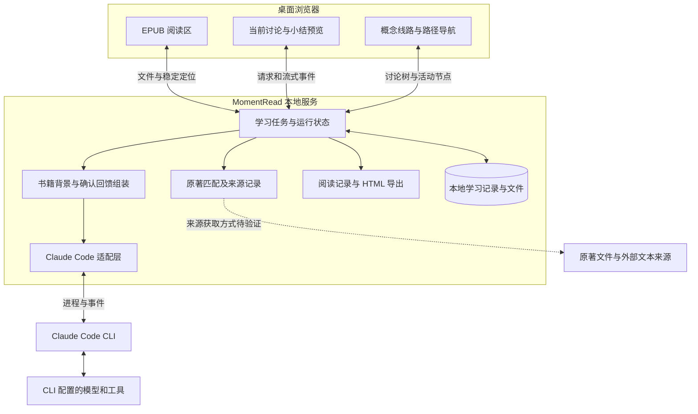

# MomentRead 技术选型与架构基线 v0.1

更新日期：2026-09-10。来源：已确认的 [PRD](PRD.md)、[视觉基线](design/README.md)、[ThoughtDAG 复用研究](research/thoughtdag-reuse.md)，以及用户对“独立网页、优先 Claude Code 桥接”的认可。本文件描述后续开发方向，当前仓库仍只有文档与静态原型。

状态分为：**已确定**（本次确认的方向）、**工程建议**（新增实现建议，尚未冻结）、**待验证**（需要运行证据的具体能力）。技术决定以本文件为准；研究报告保留当时的发现，不代表当前仍在平行选择所有后端。

## 1. 技术选择与优先级

| 层级 | 选择 | 状态及理由 |
|---|---|---|
| 产品载体 | 独立本地网页，桌面浏览器访问 | 已确定；本机服务承载读书与学习数据，安装配置由 README 说明 |
| AI 首个后端 | Claude Code CLI，经本地服务桥接 | 已确定接入顺序，尚未集成；验证通过后作为首版后端 |
| AI 运行方式 | 复用 CLI 的模型调用、工具循环和运行时上下文处理 | 已确定；MomentRead 管理学习任务与背景，不开发通用 agent 执行循环 |
| 开源复用 | 按模块提取 ThoughtDAG 的桥接、图算法和背景追踪思路 | 已确定；保留本产品的界面与讨论粒度 |
| 前端 | React + TypeScript + Vite | 工程建议；与 ThoughtDAG 技术栈接近，便于提取组件和快速调整阅读界面 |
| 本地服务 | Node.js + TypeScript；HTTP 请求与 SSE 事件流 | 工程建议；接入 Node CLI 桥接，负责持久化与运行状态；具体 HTTP 框架待脚手架阶段确定 |
| EPUB 内核 | foliate-js 优先做技术验证，epub.js 为对照／备选 | 待验证；通过选区、CFI、改字号恢复和连续滚动测试后确定及锁定版本 |
| 线路图 | SVG 与普通交互元素绘制窄栏树，React 管理选中／折叠状态 | 工程建议；复用拓扑算法，布局按静态原型实现。React Flow 保留为规模或交互需求增长后的候选 |
| 产品主存储 | SQLite 保存结构化学习记录；文件目录保存 EPUB、来源材料与导出 | 工程建议；数据库绑定、DDL、导入方式和真实数据目录须在持久化阶段定案 |
| 浏览器状态 | 组件状态保存显示、流式内容与编辑状态；需要持久化的草稿交给产品服务 | 工程建议；浏览器存储不作为学习记录的唯一副本，不继承上游整个 Zustand store |
| 书内 memory | 产品自己的概念／义项／来源／确认小结记录 | 已确定责任边界；不使用全局个人偏好记忆替代书内理解 |
| 原著匹配 | 独立匹配模块，保存候选、原文出处与核对状态 | 已确定功能边界；首个检索服务、语言支持和匹配策略待验证 |
| 阅读总结 | 从本地阅读记录构建独立 HTML，AI 辅助写总结与建议 | 已确定产出；模板与摘要调用流程待实现 |
| 依赖与启动 | 建议使用 npm；兼容的 Node 版本写入 `.nvmrc`，依赖提交锁文件 | 工程建议；本次不添加尚未经验证的版本号和启动命令 |

Vite 官方提供 React/TypeScript 模板；SQLite 官方将本地应用数据存储列为适用场景。这些支持上述工程建议，但不能代替本产品的接入验证。[Vite 文档](https://vite.dev/guide/)、[SQLite 适用场景](https://sqlite.org/whentouse.html)。foliate-js 官方提示 API 尚不稳定，因此应在阅读适配层隔离依赖并锁定经过验证的提交。[foliate-js](https://github.com/johnfactotum/foliate-js)

### 后端替代路线

- DeepSeek Harness：保留第二路线，参考 ThoughtDAG 已有插件。采用 DSH 宿主插件会改变部署边界，需要作为单独的架构变更处理；不承诺首版双后端或无缝切换。
- OpenCode：保留后续 adapter 候选，本轮不排在 Claude Code 前面。
- 直接模型 API、外部 chatbot 多网页、桌面 App：不进入当前首版实施路线。
- Claude Code 某项能力验证失败时，先记录具体失败和适配代价，再决定局部调整或更换后端，不静默改为其他调用模式。

## 2. 运行架构与职责



部署目标为一个本机产品服务。开发时可由 Vite 提供前端热更新，交付时由本地服务提供构建后的静态资源；具体端口、代理和脚本在脚手架阶段固定。Claude Code 是服务调用的本机进程，不是嵌入的聊天网页。

| 模块 | 必须承担 | 不交给它决定的事情 |
|---|---|---|
| 阅读适配层 | 文件加载、目录、选区、稳定定位、阅读进度 | 不把屏幕页码当作跨字号引用标识 |
| 讨论模块 | 多轮消息、草稿、同源兄弟节点、递归子节点、导航状态 | 不因一次普通追问创建新的线路节点 |
| 学习服务 | 创建讨论、收集背景、生成／确认小结、父级更新提醒 | 不让模型输出直接修改正式学习记录 |
| CLI 适配层 | 创建／接续运行、归一化事件、取消、权限问答、失效恢复 | 不决定书内概念含义、不把 CLI 会话目录当作产品数据库 |
| 匹配模块 | 来源获取、候选定位、版本和核对依据 | 不把 AI 回译当作找到的原文 |
| 记忆模块 | 按书和语境查询义项、保存用户确认内容及历史 | 不把同名术语强制合并、不自动生成“已掌握”状态 |
| 总结模块 | 汇总真实阅读区间、讨论与待解事项，输出可离线阅读的 HTML | 不用模型推测阅读进度或虚构成就 |

## 3. 核心信息关系

以下是领域关系草案，用于开发拆分，不是已冻结的数据库表或 API schema。

| 对象 | 最少需要表达的信息 |
|---|---|
| 书籍空间 | 书籍身份、中文文件版本、补充原著及版本、当前阅读位置、活动讨论 |
| 文本引用 | 所属文件／版本、章节、CFI 或稳定范围、选中文字、必要邻近文本 |
| 讨论 | 类型（段落解析／概念）、直接父讨论、根解析、来源消息及选区、创建背景；段落解析按书内顺序显示 |
| 消息 | 所属讨论、角色、文本与生成状态、引用来源；普通追问追加到当前讨论 |
| 运行及会话映射 | 讨论、后端、CLI 会话标识、运行标识、用途、状态、背景版本；同一讨论恢复时允许更换 CLI 会话 |
| 背景快照 | 本次传入的引用、祖先消息截点、核对状态、概念记录和确认小结版本 |
| 小结版本与回馈 | 所属讨论、草稿／确认状态、正文、出处、依赖的子小结版本、接收父讨论、确认时间 |
| 概念与义项 | 书籍、原语术语、译名、具体语境、定义、出处、待核冲突；多个讨论可以关联一个义项 |
| 阅读活动 | 实际阅读区间、时间、涉及讨论；支持生成“今日／本次”卡片 |

必须保持的约束：

1. 一本书可以有多个段落解析根节点；每个概念讨论只有一个直接父讨论，父子关系无环且不跨书。线路上连接相邻根解析只是阅读顺序，不自动成为模型上下文依赖。
2. 节点 ID 与术语文本分离。同一句或同一个词可以产生多个独立讨论，来源消息与选区可追溯，不能按标题去重。
3. 一个节点容纳多轮消息。临时换节点只修改活动位置，不完成讨论、不触发 AI。
4. “整理并返回”写入回馈记录并导航到直接父讨论，不添加反向父子边。
5. 讨论全文、确认小结与 CLI 会话分别保存。运行时压缩和会话文件缺失不会删除产品已保存的历史。
6. 初次书内概念记忆来自可追溯的确认记录；对其他分支公开使用这些记录须保留来源及确认状态，不把兄弟分支的未确认全文自动混入当前讨论。

## 4. Claude Code 接入与最小背景管理

首轮提取候选为 ThoughtDAG `runtime/agents/claude.cjs`、HTTP 桥接及相关依赖；背景算法参考 `src/lib/graph.ts` 和 `src/store/context-builder.ts`。固定研究提交与具体限制见[复用评估](research/thoughtdag-reuse.md)。

概念分支首版优先采用**新会话 + 显式背景快照**，隔离兄弟讨论。普通追问可接续当前讨论已映射的会话。原生历史 fork 是后续优化，只有准确位置与隔离测试通过后才采用，不依赖上游尚未证明的任意历史位置分叉能力。

创建背景包括书籍与来源选段、原著匹配状态、触发概念的消息及截点、必要祖先背景和相关确认记忆。记录实际选用的内容及版本；不要发送整本书或全部分支。长历史的运行时处理交给 CLI；产品只负责学习背景选择、出处与确认语义。

“整理”是同一个 Claude Code 适配层支持的另一种任务用途。建议用独立运行生成可编辑草稿，避免摘要提示污染概念讨论。不得隐式增加另一套 API 凭据或默认模型。无可靠结构化结果时保留讨论并允许重试，不把任意自然语言输出直接写成已确认记录。

会话接续时，已确认的子小结作为明确的新背景传给父讨论，按小结 ID 和版本去重；新会话恢复则从产品记录重建背景。恢复策略应保留原会话关联和失败原因。运行中断时显示中断状态，保留部分结果，不自动无限重发请求。

适配层需要的能力是：检查可用性、发起运行、接续、取消、回答权限问题和流式事件。具体路由、消息 schema、CLI 参数及支持版本在技术验证时冻结，不直接把 ThoughtDAG 全部管理接口暴露给页面。未完成的运行需按运行 ID 隔离，切换节点后也不能把输出写到新活动讨论；同一讨论的并发提交应排队或拒绝。

## 5. 整理、确认与逐层返回

建议状态为：讨论中 → 小结生成中 → 待确认 → 已回馈。生成失败允许重试；取消预览返回讨论中，原消息和编辑内容保留。

1. 收集当前讨论、关联来源和已确认的子小结，记录其版本。
2. 调用摘要任务，生成含结论、出处、争议及未完成事项的草稿。
3. 用户编辑并确认后，产品服务校验讨论、小结及依赖版本；过期预览提示重新核对。
4. 以事务或等效原子操作保存小结版本、父级回馈与所引用子小结版本。同一个确认请求重试不能重复写入。
5. 保存成功后返回直接父讨论，恢复其滚动位置与草稿。左侧书籍位置不变；不会自动发起一轮新的父讨论回答。
6. 后续父讨论提问或整理时才消费新回馈。子小结后来修订，则父级标记待合并，旧回馈保持可读；不自动重写整条祖先链。

根解析没有父讨论，界面不得提供会失败的“返回父级”操作；根解析的整理入口可用于保存当前理解或阅读总结，具体按钮文案在可点击原型中核定。

## 6. 原著匹配、存储与导出边界

原著匹配独立于问答渲染：匹配失败时可继续解析中文，同时明确“尚未对照原文”。候选带文本、语言、版本、章节或定位、来源 URL／文件、匹配依据与核对状态。后补原著后保留旧来源与修订影响，禁止覆盖旧解释来隐藏差异。用户提供原著是增强路径，自动寻找仍属于首版完整闭环。

产品学习记录由本地服务持久化；SQLite 加文件目录是当前工程建议。真实数据接入前须确定复制导入还是引用 EPUB、数据目录、schema 版本和备份恢复方式。浏览器只读到产品授权返回的文件与记录，CLI 凭据由其现有配置承担，不进入前端或 Git。

服务默认只接受本机访问；明确允许的来源和文件范围，避免任意路径读取、执行和全局会话扫描。CLI 使用产品指定的工作目录及正常权限流程，不继承 ThoughtDAG 的绕过权限开关。EPUB、检索页面及模型文本均按外来内容处理，阅读渲染与 HTML 导出不得直接执行其中的脚本。这些是本地应用边界，不扩展为首版账户系统。

HTML 卡片由产品记录确定书名、进度、讨论和确认状态，AI 仅辅助总结与建议。导出带内联样式和可离线阅读的正文，不依赖 CLI 会话或运行中的本地服务。它不是完整备份。备份必须覆盖产品数据库与必要书籍／来源文件；CLI 会话的备份或缺失重建需在 README 分别说明。

## 7. 建议代码组织

以下目录是计划，本次未创建脚手架；首版采用单仓库，不需要先拆多包或微服务。

```text
src/
  reader/          EPUB 适配、选区、目录与阅读位置
  discussions/     当前讨论、多轮消息与整理预览
  navigation/      窄线路图、路径与活动节点
  summaries/       阅读卡片界面
server/
  learning/        讨论、背景、小结确认与记忆流程
  ai/             运行管理与 Claude Code 适配
  matching/       原著来源、候选与核对
  storage/        数据访问、文件访问、迁移及备份
  exports/        独立 HTML 生成
shared/           产品领域类型与边界契约
tests/            核心逻辑、适配契约和浏览器流程
docs/             PRD、架构、设计与验证记录
```

第三方提取模块保留来源说明及许可证，记录上游固定提交和本地调整；引入代码与产品适配分别提交。首版不迁入 ThoughtDAG 的自由画布、多代理编排、全局记忆或跨工具历史扫描。

## 8. 开发顺序与完成条件

| 阶段 | 交付 | 必须取得的证据 |
|---|---|---|
| D0 脚手架与 CLI 技术验证 | 固定运行时／依赖，独立网页与本地服务可启动；最小 Claude Code 适配 | 合成内容验证首次响应、流式事件、取消、失败提示、接续、新分支隔离、独立整理；确认可用认证和 CLI 版本 |
| D1 可点击阅读工作台 | 沿用所选视觉，模拟段落、兄弟和深层概念，预览与返回 | 对应 PRD A03–A07、A14–A16、A19 的交互验证；模拟回答明确标识 |
| D2 EPUB 与持久化 | 通过验证的阅读内核，选段定位，产品记录保存及重开 | 定案数据库／数据目录／导入方式；真实 EPUB 测试字号及面板变化、跨段选取、重启和活动深层节点恢复 |
| D3 真实学习闭环 | AI 解析、分支、版本化回馈、书内概念与原著匹配 | 兄弟隔离；嵌套返回；重复确认和保存失败；子小结更新；匹配无结果及歧义；同词多义与来源可追溯 |
| D4 HTML 与首次使用验收 | 阅读卡片、备份恢复和正式 README | 卡片离线可读且事实对应记录；干净环境按 README 安装并完成实际阅读；覆盖 PRD A01–A21 |

D0–D2 可以先使用合成数据打通各模块，但不能因为模拟闭环可用就宣称原著匹配或完整 MVP 已交付。付费调用、私人书籍处理和任何外部发布按具体任务范围执行，不随文档更新发生。

## 9. 当前开发起点

- 已完成：需求、静态视觉、ThoughtDAG 固定提交研究和 6 项图算法测试，本轮更新架构及文档索引。
- 尚未开始：应用代码、依赖安装、第三方源码迁入、CLI 接入、真实 EPUB 验证、数据库和 HTML 功能。
- 下一步：按 D0 准备脚手架与最小 Claude Code 验证；记录具体结果后进入 D1。待验证能力失败时只调整相关部分，不重复推翻已确认产品布局。
- 本轮文档核验：检查相对链接、技术状态表、PRD 一致性及 Git 差异；运行结果以仓库提交记录为准。

前端栈、存储和接口方案属于工程建议，正式接入前需核定；不会将本轮补充建议追溯为用户已逐项批准的结构决定。新增结构决定在本文件记录日期、理由、影响及验证结果。
