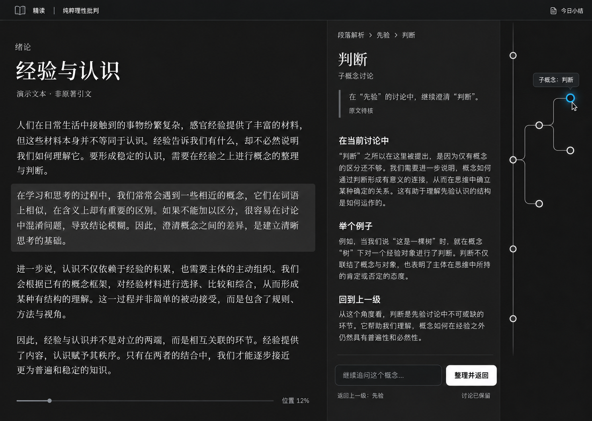

# MomentRead 设计基线

来源：2026-09-10 与 Darren 的需求讨论及原型选择。图像由内置 Image Gen 生成；用户选择第 3 张的深色与字体风格，并认可补齐同源多概念和递归分支后的修订图。

## 已选定的视觉目标

- 左侧 EPUB，右侧显示当前 AI 讨论，最右侧为线路图。
- 保留深色黑白灰、衬线阅读字体和当前的文字层级；生成图不包含可靠的字体元数据，实际字体文件和字号需实现时比对。
- 同一个段落解析可以分出多个兄弟概念讨论；每个概念讨论可以继续分出子讨论。
- 线路图默认不显示文字，仅悬停节点时显示名称；蓝色光圈只表示当前节点。
- 右侧顶部显示层级路径，“整理并返回”返回直接父讨论。

图中书籍正文和 AI 回复是演示文字，不是已核对的原著译文。该图为静态视觉目标，不证明点击、持久化或 AI 接入已经实现。

## 最初的线路参考

[查看用户提供的参考图](route-reference.png)。保留其主线与分支的关系；实际设计已经改为黑白灰和唯一蓝色当前光圈，取消原图常驻文字及其他彩色分支。

## 文件来源与维护

- `selected-prototype.png`：用户认可的递归分支修订图，源生成文件名为 `exec-08d49928-8517-496f-ac48-a64359af9e9f.png`。
- `route-reference.png`：用户在本次对话上传的线路参考图，原样复制。
- 导入时逐文件比对 SHA-256，图片字节与源文件一致。
- 后续视觉调整先保留当前目标，再按新版本产出；不要仅凭候选序号猜测对应图片。

当前已确定独立本地网页版与 Claude Code 首个后端，后续开发沿用本视觉目标。模块职责、工程建议及验证顺序见 [技术选型与架构](../ARCHITECTURE.md)，功能验收见 [PRD](../PRD.md)。

## UI／UX v1 交付

[设计说明](UI-UX.md)覆盖书架、阅读工作台、递归分支、整理预览、来源核对和今日小结；[可运行原型](../../prototype/README.md)提供启动与体验步骤；[验收记录](../../prototype/design-qa.md)记录浏览器检查与限制。辅助视觉方向保存在 `ui-v1/`，主视觉目标保持不变。
